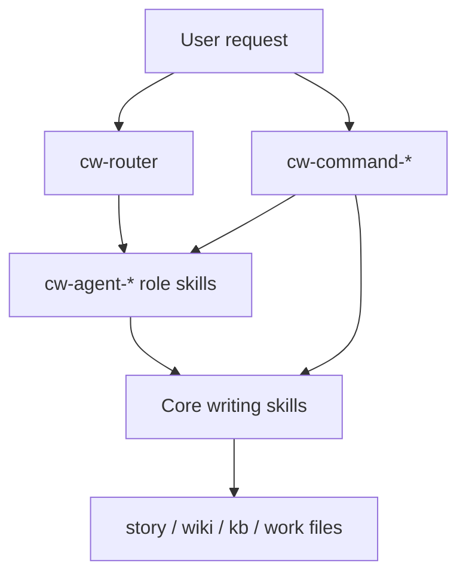

# Codex Writing Skills Architecture

## Layers

## Command-Entry Skills

Command-entry skills provide short, explicit workflow triggers:

| Skill | Use |
|---|---|
| `cw-command-bs` | Explore story ideas without committing to canon |
| `cw-command-write` | Draft or revise prose |
| `cw-command-wiki` | Document finalized canon |
| `cw-command-critique` | Critique existing prose |

These are not shell commands. They are Codex skills that can be invoked by natural language or slash-style text when the client passes that text through.

## Role Skills

Role skills guide the current Codex assistant into specialist writing behavior:

| Area | Role skills |
|---|---|
| Orchestration | `cw-agent-story-orchestrator`, `cw-agent-draft-orchestrator`, `cw-agent-knowledge-orchestrator` |
| Creation | `cw-agent-writer`, `cw-agent-brainstormer`, `cw-agent-outliner`, `cw-agent-character-sim`, `cw-agent-style-creator` |
| Review | `cw-agent-critic`, `cw-agent-reader-sim`, `cw-agent-continuity-checker` |
| Knowledge | `cw-agent-wiki-editor`, `cw-agent-chronicler`, `cw-agent-session-miner`, `cw-agent-graph-maintainer`, `cw-agent-explorer`, `cw-agent-researcher` |

Role skills may coordinate a workflow, but they do not imply automatic parallel execution. Codex subagents are used only when the user explicitly asks for delegated or parallel agent work.

## Project Files

The skills assume ordinary files and directories:

- `story/`: chapters, scenes, manuscript drafts
- `wiki/`: reader-facing reference pages
- `kb/`: author-facing canon, character state, timeline, style, issues
- `work/`: temporary brainstorms, outlines, critique notes, and revision artifacts

Projects can use different names if the user points Codex to the relevant files.
